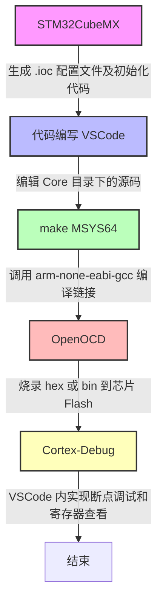
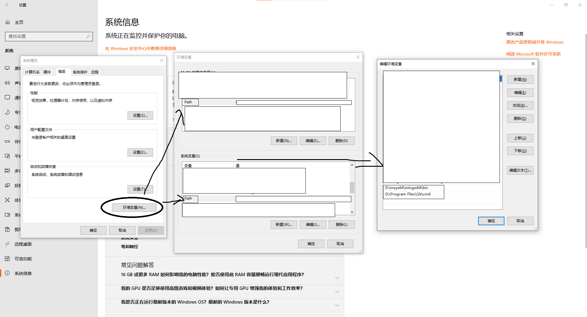
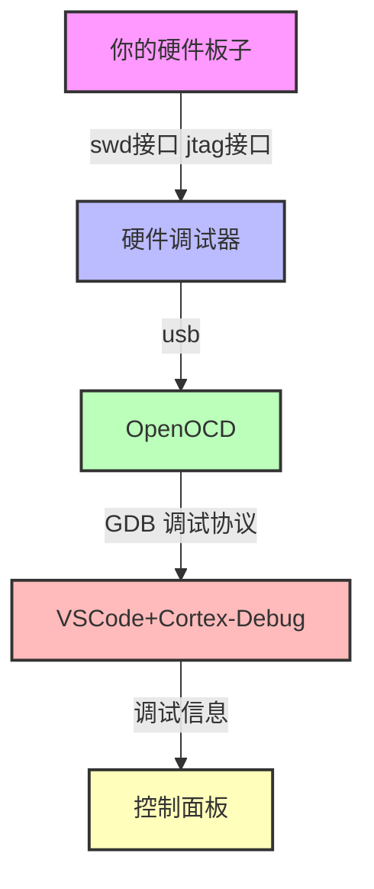
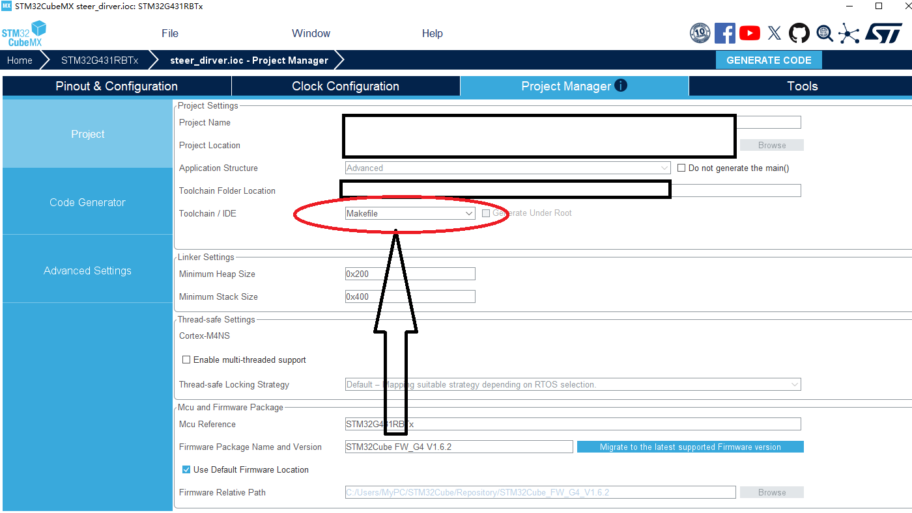
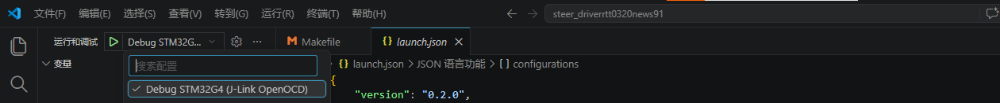

# 《摆脱IDE束缚：在win下STM32 GCC + Makefile + MSYS64 + VSCode 完全开发环境搭建指南》
---
author: luluyis
date: 2026-07-15
tags: [STM32, Makefile, VSCode, MSYS2, 嵌入式开发]
description: 手把手教你从零搭建 STM32 开源开发环境，彻底告别 Keil/IAR 的束缚
---
## 一、引言
### 1.1 为什么放弃 Keil/IAR？
- 商用授权费用高，断网使用时又无法使用 vibe codeing
- 代码编辑器体验落后，AI代码编辑补全重构能力弱
- 跨平台支持差，难以在 macOS/Linux 下统一开发
- 工程配置分散，难以进行版本管理和 CI/CD 集成

### 1.2 为什么选择这套技术组合？

| 组件 | 选择理由 |
|------|----------|
| **VSCode** | 现代化编辑器，插件生态丰富，免费且跨平台 |
| **MSYS64** | Windows 下提供类 Unix 命令行环境，让 Makefile 能够原生运行 |
| **Makefile** | 轻量、可读、可版本控制，无厂商锁定，易于集成自动化流程 |
| **ARM GCC** | 开源交叉编译工具链，社区活跃，更新及时 |
| **OpenOCD** | 开源调试烧录工具，支持多种调试器和芯片 |
| **STM32CubeMX** | 图形化配置工具，自动生成初始化代码，降低学习门槛 |

### 1.3 适用读者与前置知识

- 已具备 STM32 基础开发经验（了解 HAL 库基本使用），使用过stmcubemax
- 熟悉 C 语言语法
- 了解基本的命令行操作（cd、ls、环境变量等）
- 希望从传统 IDE 迁移到命令行 + 编辑器的工作流

### 1.4 本文目标

读完本文后，你将能够：

- ✅ 在 Windows 下完整搭建 STM32 开源开发环境
- ✅ 使用 VSCode 编写代码、一键编译、烧录和调试
- ✅ 理解 Makefile 的核心结构并具备修改能力
- ✅ 将这套环境应用到自己的实际项目中

## 2. 整体架构概览

### 2.1 工具链数据流


### 2.2 各组件职责清单

| 组件 | 安装方式 | 核心职责 |
|------|----------|----------|
| MSYS2 / MSYS64 | 官网安装包 | 提供 `make`、`bash`、`git` 等 Unix 工具 |
| arm-none-eabi-gcc | 官方包 / xPack | 将 C 代码交叉编译为 ARM Cortex-M 机器码 |
| OpenOCD | MSYS2 包 / 预编译版 | 通过调试器（ST-Link/J-Link）烧录与在线调试 |
| STM32CubeMX | 官网安装包（需 Java） | 图形化配置外设、时钟，生成初始化工程 |
| VSCode | 官网安装包 | 代码编辑、任务执行、调试界面 |
| Cortex-Debug | VSCode 插件 | 连接 OpenOCD，提供图形化调试界面 |


## 3. 环境安装与配置（实战）

### 3.1 MSYS2 / MSYS64 安装与配置(下载LIUNX环境下的命令行)

在win环境下，makefile不能够正常使用，需要类UINX环境 如 Liunx/Macos 才能使用，MSYS2能够为win提供UINX环境
1. **下载安装包**

   1. 访问 [MSYS2 官网](https://www.msys2.org/)，下载最新 x86 或者 arm 安装包。
   2. [通过我提供的版本x86版本 msys2-x86_64-20260611.exe ](https://pan.quark.cn/s/3e2a28a624e5?pwd=iMUx)

2. **安装**

   按默认路径安装或者自定义路径（例如我的 `D:\msys64`，需要记住，后期使用），安装完成后按提示启动。

3. **首次启动并更新核心包**

   打开 `MSYS2 MSYS` 终端，执行以下命令：

```bash
   pacman -Syu
```
4. **然后将下面的指令输进去**
   
```bash
   pacman -S --needed base-devel mingw-w64-x86_64-toolchain git
   #上面的包 应该包含了下面部分的包，我这里已经将环境配置好了，有点忘记具体需要哪些环境包了，你可以直接全都下载上，或者先执行上面的命令，编译不通过再执行下面的。
   pacman -s base
   pacman -s filesystem
   pacman -s gcc
   pacman -s make
   pacman -s mingw-w64-x86_64-gcc
   pacman -s mingw-w64-x86_64-make
   pacman -s mingw-w64-x86_64-openocd 
   pacman -s msys2-runtime 
```
5. **将MSYS2的环境，加入到电脑的环境变量**
```bash
   # 根据你个人的路径进行更改配置
   D:\msys64\mingw64\bin #按照文件路径来说，应该不需要这个，但是OpenOCD的路径在这里，以及有没有其他路径也在这里面我不清楚，如果你使用MSYS2内置的Openocd就一定要加上。
   D:\msys64\usr\bin  # 这个一定要加上
```
   
### 3.2 ARM GCC 交叉编译工具链
#### 3.2.1 什么是交叉编译工具链？
交叉编译工具链，简单来说，就是在一个平台上，编译生成能在另一个完全不同平台上运行的程序所需的整套工具。
- 本地编译：就像你在 Windows 电脑上写代码，然后用 Visual Studio 编译，最终生成的 .exe 程序也跑在同一个 Windows 系统上。编译和运行的环境是同一个。
- 交叉编译：想象一下，你有一台性能强劲的 x86 架构电脑（比如 Intel 或 AMD 处理器），你想为一个小巧的 ARM 架构开发板（比如 STM32 单片机）编写程序。但是，ARM 开发板本身性能太弱，无法运行编译器等大型软件。这时，你就需要在你的 x86 电脑上运行一个特殊的编译器，它生成的机器码是专门给 ARM 芯片“读”的。编译和运行的环境是不同的，这就叫“交叉”。
#### 3.2.2我们在此之前可能接触的交叉编译链有哪些？
1. KEIL 我们平常使用的keil，已经集成好了我们需要的大部分东西，包括它的交叉编译工具链
    - Arm Compiler 5 (AC5)：经典的“老将”。其核心编译命令是 armcc。在 MDK V5 的早期到中期版本（如 V5.25 至 V5.36 时代）中非常普遍，至今仍被许多项目广泛使用。
    - Arm Compiler 6 (AC6)：基于 LLVM 技术的新一代编译器，核心命令是 armclang。从 MDK V5.32 开始，它开始成为默认编译器，具有更好的现代 C/C++ 标准支持和更快的编译速度
2. IAR 也和keil一样，包含交叉编译工具链
    - IAR C/C++ Compiler (闭源) 具有广泛的芯片架构支持
3. MounRiver Studio(MRS) 主播之前使用的一款国产riscv芯片的编译平台。
    - riscv-wch-embedded-gcc 沁恒半导体出的自家的交叉编译链
#### 3.2.2 交叉编译工具链安装与配置(arm-gnu-toolchain-15.2.rel1-mingw-w64-i686-arm-none-eabi) 
1. **下载**

    1. 使用 [xPack GNU Arm Embedded GCC](https://xpack-dev-tools.github.io/arm-none-eabi-gcc-xpack/)
    2. [ARM 官方站点](https://developer.arm.com/tools-and-software/gnu-toolchain)
    3. [我从RAM官方站点拷贝的x86版本](https://pan.quark.cn/s/3e2a28a624e5?pwd=iMUx)

2. **解压安装**
    1. xPack GNU Arm Embedded GCC 解压到你指定的目录
    2. msys2-x86_64-20260611.exe 下载到你指定的目录
3. **加入系统 PATH**
    如同3.1 里面第5条，在 Path 中添加：
```bash
    # 根据你个人的路径进行更改配置 这里我使用的是ARM 官方站点下载的方式，xPack的包，里面的内容相同路径为 .\bin
    D:\Program Files (x86)\Arm\GNU Toolchain mingw-w64-i686-arm-none-eabi\bin
```
1. **验证**
    打开powershell，执行：
```bash
    arm-none-eabi-gcc --version
```
会出现下面结果
```bash
    arm-none-eabi-gcc.exe (Arm GNU Toolchain 15.2.Rel1 (Build arm-15.86)) 15.2.1 20251203
    Copyright (C) 2025 Free Software Foundation, Inc.
    This is free software; see the source for copying conditions.  There is NO
    warranty; not even for MERCHANTABILITY or FITNESS FOR A PARTICULAR PURPOSE.
```

### 3.3 OpenOCD 
#### 3.3.1 OpenOCD是什么
    是一个开源的片上调试和编程工具。你之前在 MSYS2 中安装的 mingw-w64-x86_64-openocd 就是它。
    简单来说，它在你的电脑（主机）和嵌入式芯片（目标板）之间扮演了一个翻译官和中间人的角色。

**我们在此之前可能接触的类似OPENOCD的有哪些？**
1. KEIL 仍然如此强大，集成了自家的闭源GDB调试协议
2. IAR 也是如此
3. MounRiver Studio(MRS) 再这里使用的是OpenOCD
4. 我们经常用的JLINK调试器，官方有他们自己的JINKGDBSERVE(这个后期会提到)

#### 3.3.2 OpenOCD 的安装
1. **通过 MSYS2 安装**
打开 `MSYS2 MSYS` 终端，执行以下命令：
```bash
    pacman -s mingw-w64-x86_64-openocd  # 在上面制作类UINX环境，已经有提到下载，但是，这里推荐方式二，因为，OpenOCD许多地方都能用到，而使用MSYS2，则环境限制在了这个软件，你如果后期删除，openocd就没有了，当然，在你搭建的这个环境里面，这个条件是绝对满足的。
```
2. **下载预编译版**

    1. [从 OpenOCD 官网下载](https://openocd.org/)
    2. [我这里下载好的版本](https://pan.quark.cn/s/3e2a28a624e5?pwd=iMUx)
解压并添加 bin/ 到 PATH。
```bash
    D:\xpack-openocd-0.12.0-7\bin #本人的路径 实际路径根据个人调整
```
1. **验证：**
   在powershell中
```bash
    openocd --version
```
会有类似
```bash
    Open On-Chip Debugger 0.12.0
    Licensed under GNU GPL v2
    For bug reports, read
    http://openocd.org/doc/doxygen/bugs.html
```
### 3.4 STM32CubeMX 安装
这里默认你安装了STM32CubeMX
### 3.5 VSCode 与必要插件
这里默认你会安装vscode
从 VSCode 官网 下载安装
C/C++（微软官方，提供 IntelliSense）
Cortex-Debug（调试核心）
推荐插件：
Makefile Tools（Makefile 语法高亮和快捷编译）
Serial Monitor（串口调试）
STM32 VS Code Extension（辅助工具）

## 4. 项目创建与配置（核心）
### 4.1 使用 CubeMX 生成基础项目
- 打开 STM32CubeMX，选择芯片型号（如 STM32F103C8T6）我这里使用的是stm32G431RBTx
- 配置时钟树（RCC → HSE → PLL → 系统时钟 72MHz）
- 配置所需外设（如 USART1 用于串口调试，PC13 连接板载 LED ）在这里debug (serial wire or jtag )要打开，不然没有调试。
- 点击 Project Manager，进行如下设置：
- Project Name：my_stm32_project
- Project Location：选择保存路径
- Toolchain/IDE：选择 Makefile
  
- 点击 Generate Code，生成工程
### 4.2 编译烧录测试
1. 编译
可以用vscode打开文件夹，然后使用终端
```bash
    make
```
会出现编译，并生成elf hex等文件
2. 清除
清除编译生成文件
```bash
    make clean
```
3. 烧录
如果想要使用调试器烧录
我这里使用的是jlinkV9，jinkV9不适配openocd，需要将jink驱动接口转换成usb驱动接口，我会提供相应软件[zadig-2.9.exe](https://pan.quark.cn/s/3e2a28a624e5?pwd=iMUx)。
如果你使用的是调试器，是usb接口的，则可以直接使用，只需要将jink.cfg更改成相应的名称，如cmsis-dap.cfg  stlink.cfg 等。
这里使用的是以jlink为例，具体的根据你自己的调试器为主，市面上大部分的调试器都能够正常使用。
```bash
    openocd -c "adapter driver jlink,transport select swd" -f interface/jlink.cfg -f target/stm32f4x.cfg -c "program build/firmware.elf; exit"
```
4. 快捷烧录
如何感觉每次烧录太麻烦可以在 `makefile`文件末尾里面增加
```bash
# 烧录目标（依赖编译出的 .elf）#这个具体内容，根据你实际的内容及进行更改
flash:
	openocd -c "adapter driver jlink,transport select swd" -f interface/jlink.cfg -f target/stm32f4x.cfg -c "program build/$(TARGET).elf; exit"
```
这样就可以执行命令`make flash`进行烧录
```bash
    make flash 
```
### 4.3 编译烧录测试
创建 .vscode/launch.json
我这里使用的是jlink，实际内容根据你的link+GDB+芯片调整。
这段json里面的文件，SVD文件是调试用来查表用的，形象来说就是调试软件需要一份说明书，来看寄存器。
```json   
   {
    "version": "0.2.0",
    "configurations": [
        // {
        //     "name": "Debug STM32G4 (J-Link OpenOCD)",
        //     "type": "cortex-debug",
        //     "request": "launch",
        //     "servertype": "openocd",
        //     "cwd": "${workspaceFolder}",
        //     "executable": "${workspaceFolder}/build/project_name.elf",// 修改为你实际的elf文件名
        //     "openOCDLaunchCommands": [
        //          "adapter driver jlink",
        //          "transport select swd"
        //      ],
        //     "configFiles": [
        //         "interface/jlink.cfg",
        //         "target/stm32g4x.cfg"
        //     ],
        //     "runToEntryPoint": "main",
        //     "svdFile": "${workspaceFolder}/STM32G431.svd", // 如果有SVD文件的话
        // },

        {
            "name": "Debug STM32G4 (J-Link OpenOCD)",
            "type": "cortex-debug",
            "request": "launch",
            "servertype": "openocd",
            "cwd": "${workspaceFolder}",
            "executable": "${workspaceFolder}/build/project_name.elf",// 修改为你实际的elf文件名
            // "openOCDLaunchCommands": [
            //     "adapter driver jlink",
            //     "transport select swd"
            // ],
            "configFiles": [
                "interface/jlink_swd.cfg",//jlink.cfg 修改文件，裏面定义了 adapter driver jlink     transport select swd 这里，我为了适配对jink.cfg进行了修改
                "target/stm32g4x.cfg"
            ],
            "runToEntryPoint": "main",
            "svdFile": "${workspaceFolder}/STM32G431.svd", // 如果有SVD文件的话，这个文件要从芯片工程包里面获取，这里下载推荐路径为keil官方下载，当然实际你可能使用的其他芯片，keil官方找不到，stm32官方工程包为没有找到，应该没有提供。
        },
        

        {
            "name": "Debug STM32G4 (J-Link GDB Server)",
            "type": "cortex-debug",
            "request": "launch",
            "servertype": "jlink",
            "cwd": "${workspaceFolder}",
            "executable": "${workspaceFolder}/build/project_name.elf",// 修改为你实际的elf文件名
            "device": "STM32G431RB",  // 替换为你的具体型号
            "interface": "swd",
            "runToEntryPoint": "main",
            "svdFile": "${workspaceFolder}/STM32G431.svd"//这个文件要从芯片工程包里面获取，这里下载推荐路径为keil官方下载，当然实际你可能使用的其他芯片，keil官方找不到，stm32官方工程包为没有找到，应该没有提供。
        }
    ]
}
```

这个文件创立以后
vscode 打开 `运行与调试` 会出现 


这个时候，这个项目环境搭建彻底完成


## 关于作者

**网名/姓名**：luluyis  
**技术方向**：
嵌入式软件开发 / IoT / 开源硬件  
**个人博客**：no  
**GitHub**：
    [https://github.com/luluyis-law](https://github.com/luluyis-law)   
**邮箱** ：
    luluyis.law@gmail.com
    luluyis@qq.com
**微信**：
    Karl-Derek-Law
**Discord**：
    luluyis

---


